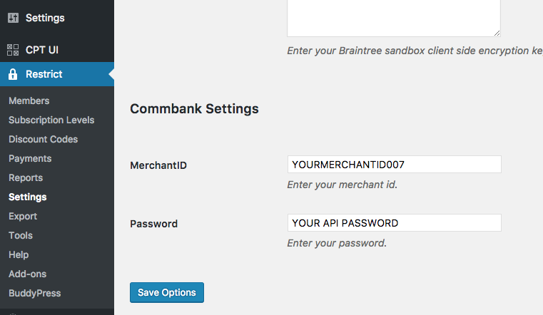

# Commbank
A custom payment gateway for Commbank

## Setup
Once the plugin is installed and activated, go to the *Restrict Settings* page in the WordPress Admin (Restrict &rarr; Settings).

Select the *Payments* tab and add the Commbank **Merchant ID** and **API Password**. You can generate your API Password by following the instruction [here](https://na24.salesforce.com/sfc/p/90000000sUDO/a/1a000000PmAe/ZagFQ6nLThgTIX8lX_MILT7sv6sU8VhQKN3Inu91kAg). Also enable **Commbank** at the top of the page and update the currency to "Australian Dollars".

## Testing
Navigate to the *Registration Page* and create a new user. When the form is submitted, the payment data will be submitted to Commbank. Any errors will be displayed on the registration form. If there were no errors, then the member will become active and be redirected to the welcome page.